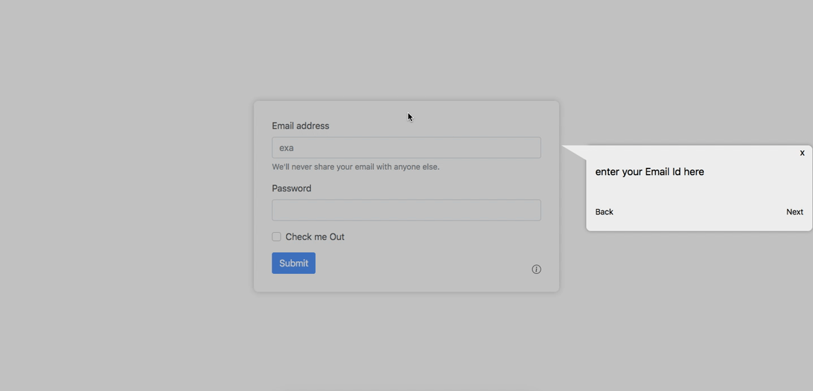

# How to do

## Installation
```
npm i howtodo
```
## About this Project
A simple JavaScript libarary (**_howtodo_**) which can give you a power to create a instruction session fun and easy for all your **_Web Products_** .


<!-- <div style="text-align:center;margin-bottom:1rem;margin-top:1rem"></div> -->

## Usage
Just By these simple steps you can show anyone ```"How to do this?"``` Anywhere in you website

#### HTML

Include the wizard.js file at the bottom of your html file
```HTML
<script src="../../wizard.js"></script>
```

Give div a id : ```"instructionsModal"```
```html
<div id="instructionsModal">

</div>
```

#### JavaScript

Make a new howToDoWizard and pass the values.

```JavaScript
var instruction = new howToDoWizard(array, id, autoplay, interval,navigation); //id = id of the instruction from the array

// to start a fun session
instruction.play(); 
```


||Description|     
|----|-----|      
|```array```|list of instructions session  |
|```id```|id of the perticular instruction session from the array  |
|```autoplay```| to run the instruction session with any navigation . By default it is ```false```|
|```interval```| time in which th next step will be shown . By default it is ```3000ms```|
|```navigation```|By default it is ```true```|

Example of a instruction with multiple topics and multiple steps.

```JavaScript
var listOfInstruction = [
{
    id: 0,
    title: "how to fill the form",
    instruction: [
            {
                stepId: 0,
                step: "Enter Your Email id Here",
                id: "emailId",
                example: {
                    placeholder: "example@gmail.com",
                    text: "Lorem ipsum dolor sit amet consectetur adipisicing elit. Iste rem vitae minima, dignissimos",
                    imageUrl:
                    "https://techcrunch.com/wp-content/uploads/2018/01/giphy1.gif?w=730&crop=1",
                    audioUrl: "/static/assets/audio/waterfall.mp3",
                }
            },
            {
                stepId: 1,
                step: "Enter Your Password here Here",
                id: "password",
                example: {
                    placeholder: "a2@bcqwe",
                }
            }
        ],
    },
    id: 1,
    title: "how to do this",
    instruction: [
            {
                stepId: 0,
                step: "Do Something Here",
                id: "eleId",
                example: {
                    placeholder: "example@gmail.com",
                    text: "Lorem ipsum dolor sit amet consectetur adipisicing elit. Iste rem vitae minima, dignissimos",
                    imageUrl:
                    "https://techcrunch.com/wp-content/uploads/2018/01/giphy1.gif?w=730&crop=1",
                    audioUrl: "/static/assets/audio/waterfall.mp3",
                }
            }
        ],
    },
];
```
> * ```id``` : Must be  unique . For initializing the correct instruction session. ```Important```
> * ```title``` : As the name suggest title/topic of the session. ```Important```
> * ```instruction``` : It is a array in which every object is Step of the perticular session. ```Important```
>     * ```step``` : heading of the wizard window and also the heading of the perticular step. ```Important```
>     * ```id```: Same as the DOM Element id for which this step is initiated (Unique)
>     * ```example```: It is a Object which will give power to insert exmples for the instruction for eg: Placeholder : Mimic a input for better understanding,imgage:to show a example visually, and also you can add audio for more fun sessions,and also you can add text .
>          * ```placeholder``` : add if you have a input and want to mimic a example value , ```audioUrl``` : add if you have a audio file to play,```imageUrl``` : add if you have a image or illustration to show better example,```text``` : add if you want to show some text under the image or juts want to show the text

 A simple Example showing how the Widget will look with diffrent ```examples```

>With Image in it


>With only Text in it


>With only Text and Image in it


<!-- <div style="display:flex;flex-wrap:wrap;justify-content:space-between">
    <div style="width: 33%;">
        
        <p style="text-align:center">Image 1</p>
    </div>
    <div style="width: 33%;">
        
        <p style="text-align:center">Image 2</p>
    </div>
    <div style="width: 33%;">
        
        <p style="text-align:center">Image 3</p>
    </div>
</div>

* ```Image 1``` : A Instruction with Image in it
* ```Image 2``` : A Instruction with only Text in it
* ```Image 3``` : A Instruction with image & Text  -->

## Customization
You can also change the background and font color of the pop up window just by passing the value in ```.play()```


```JavaScript
var backgroundColor = "#000"
var fontColor = "#fff"
instruction.play(backgroundColor,fontColor);

```
<!-- <div style="text-align:center;margin-bottom:3rem;margin-top:1rem"></div> -->


